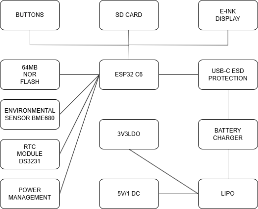

# OpenBook

**Autor:** Sandu Victor, 332CC

---

## 1. Descriere generală

Acest proiect propune o platformă hardware pentru dezvoltarea de aplicații IoT și afișare e-paper, cu consum redus de energie. Elementul central este microcontrollerul **ESP32-C6-WROOM-1**, care oferă conectivitate Wi-Fi 6 și Bluetooth Low Energy. Sistemul este proiectat pentru a funcționa atât conectat la USB-C, cât și alimentat de la o baterie Li-Po.

---

## 2. Caracteristici cheie

- **Alimentare prin USB-C**: Simplifică programarea și încărcarea bateriei.
- **Microcontroller ESP32-C6**: Include nucleu RISC-V, Wi-Fi 6, BLE și memorie flash internă de 8MB.
- **Senzori integrați**: BME688 (temperatură, umiditate, presiune, gaze) și DS3231 (ceas de timp real).
- **Stocare suplimentară**:
  - Card SD (SPI)
  - Memorie NOR Flash (W25Q512)
- **Afișaj E-Paper**: Consum ultra-redus, actualizare doar la nevoie.
- **Monitorizare baterie**: MAX17048 pentru nivelul de încărcare.

---

## 3. Structură hardware (sumar)

- **USB-C** și protecții ESD (varistori, diodă TVS).
- **Circuit încărcare Li-Po** cu MCP73831.
- **Regulator LDO** pentru 3.3V stabil.
- **Microcontrollerul ESP32-C6-WROOM-1** (SPI, I2C, GPIO).
- **Senzori**:
  - BME688 (I2C)
  - DS3231 (I2C)
- **Memorii**:
  - Card SD (SPI)
  - W25Q512 (SPI)
- **E-Paper** cu driver SPI și alimentare comutabilă (MOSFET).
- **Butoane** de RESET și BOOT.

*(Diagrama de mai sus este inclusă din `Images/Diagrama.png`.)*

---

## 4. Bill of Materials (BOM)

| Component  | Supplier Link | Datasheet |
|------------|---------------|-----------|
| 112A-TAAR-R03 | [Model](https://store.comet.srl.ro/Catalogue/Product/43497/) | [Datasheet](https://www.snapeda.com/parts/112A-TAAR-R03/Attend/datasheet/) |
| 744043680 | [Model](https://ro.mouser.com/ProductDetail/Wurth-Elektronik/744043680?qs=PGXP4M47uW6VkZq%252BkzjrHA%3D%3D) | [Datasheet](https://www.we-online.com/components/products/datasheet/744043680.pdf) |
| BD5229G-TR | [Model](https://componentsearchengine.com/part-view/BD5229G-TR/ROHM%20Semiconductor) | [Datasheet](https://fscdn.rohm.com/en/products/databook/datasheet/ic/power/voltage_detector/bd52xxg-e.pdf) |
| Capacitor 0402 | [Model](https://ro.mouser.com/c/passive-components/capacitors/ceramic-capacitors/?q=CC0402&srsltid=AfmBOoogjqwwed3xvp6V5-bfVkRuawirfMcnAC47L-UQdC3mnXJk097M) | [Datasheet](https://componentsearchengine.com/Datasheets/2/CC0402MRX5R5BB106.pdf) |
| CPH3225A | [Model](https://www.snapeda.com/parts/CPH3225A/Seiko+Instruments/view-part/?ref=snap) | [Datasheet](https://www.snapeda.com/parts/CPH3225A/Seiko%20Instruments/datasheet/) |
| Custom Button | [Model](https://industry.panasonic.com/global/en/products/control/switch/light-touch/number/evqpuj02k) | [Datasheet](https://industry.panasonic.com/global/en/downloads?tab=catalog&small_g_cd=203&part_no=EVQPUJ02K) |
| DS3231SN | [Model](https://www.snapeda.com/parts/DS3231SN%23/Analog+Devices/view-part/?ref=eda) | [Datasheet](https://www.snapeda.com/parts/DS3231SN%23/Analog%20Devices/datasheet/) |
| ESP32 WROVER 0805 Capacitor | [Model]() | [Datasheet]() |
| ESP32 WROVER BME680 Sensor | [Model](https://www.snapeda.com/parts/BME680/Bosch/view-part/?welcome=home) | [Datasheet](https://www.bosch-sensortec.com/media/boschsensortec/downloads/datasheets/bst-bme680-ds001.pdf) |
| ESP32 WROVER MCP73831 Power Management | [Model](https://www.snapeda.com/parts/BME680/Bosch/view-part/?welcome=home) | [Datasheet](https://www.snapeda.com/parts/MCP73831T-2ACI/OT/Microchip/datasheet/) |
| ESP32C6 Varistor 1812 | [Model]() | [Datasheet]() |
| ESP32C6 WROOM-1-N8| [Model](https://www.snapeda.com/parts/ESP32-C6-WROOM-1-N8/Espressif+Systems/view-part/?ref=eda) | [Datasheet](https://www.snapeda.com/parts/ESP32-C6-WROOM-1-N8/Espressif%20Systems/datasheet/) |
| FH34SRJ-24S-0.5SH | [Model](https://ro.mouser.com/ProductDetail/Hirose-Connector/FH34SRJ-24S-0.5SH99?qs=vcbW%252B4%252BSTIpKBl5ap9J8Fw%3D%3D) | [Datasheet](https://www.snapeda.com/parts/FH34SRJ-24S-0.5SH(99)/Hirose%20Connector/datasheet/) |
| LED Chip 0603 | [Model](https://www.snapeda.com/parts/KP-1608SURCK/Kingbright/view-part/?ref=search&t=LED%200603) | [Datasheet](https://www.snapeda.com/parts/KP-1608SURCK/Kingbright/datasheet/) |
| MAX17048G+T10 | [Model](https://www.snapeda.com/parts/MAX17048G+T10/Analog+Devices/view-part/?ref=eda) | [Datasheet](https://www.snapeda.com/parts/MAX17048G+T10/Analog%20Devices/datasheet/) |
| MBR0530 Schottky Diode | [Model](https://www.snapeda.com/parts/MBR0530/Onsemi/view-part/?ref=snap) | [Datasheet](https://www.snapeda.com/parts/MBR0530/ON%20Semiconductor/datasheet/) |
| PGB1010603MR | [Model](https://www.snapeda.com/parts/PGB1010603MR/Littelfuse/view-part/?ref=eda) | [Datasheet](https://www.snapeda.com/parts/PGB1010603MR/Littelfuse%20Inc./datasheet/) |
| QWIIC Connector | [Model](https://www.snapeda.com/parts/PRT-14417/SparkFun/view-part/) | [Datasheet](https://www.snapeda.com/parts/PRT-14417/SparkFun%20Electronics/datasheet/) |
| RCL CPOL 3528 | [Model](https://www.snapeda.com/parts/CPH3225A/Seiko+Instruments/view-part/?ref=eda) | [Datasheet](https://s3.amazonaws.com/snapeda/datasheet/TAJB475K025RNJ_AVX.pdf) |
| Resistor 0402 | [Model](https://grabcad.com/library/resistor-0402-1) | [Datasheet](https://www.yageo.com/upload/media/product/products/datasheet/rchip/PYu-RC_Group_51_RoHS_L_12.pdf) |
| SI1308EDL-T1-GE3 MOSFET | [Model](https://www.snapeda.com/parts/SI1308EDL-T1-GE3/Vishay+Siliconix/view-part/?welcome=home&ref=eda) | [Datasheet](https://www.snapeda.com/parts/SI1308EDL-T1-GE3/Vishay%20Siliconix/datasheet/) |
| SJ | [Model](https://grabcad.com/library/solder-jumpers-1) | [Datasheet]() |
| USB4110-GF-A | [Model](https://componentsearchengine.com/part-view/USB4110-GF-A/GCT%20(GLOBAL%20CONNECTOR%20TECHNOLOGY)) | [Datasheet](https://gct.co/files/drawings/usb4110.pdf) |
| USBLC6-2SC6Y | [Model](https://www.snapeda.com/parts/USBLC6-2SC6Y/STMicroelectronics/view-part/?welcome=home&ref=eda) | [Datasheet](https://www.snapeda.com/parts/USBLC6-2SC6Y/STMicroelectronics/datasheet/) |
| W25Q512JVEIQ | [Model](https://www.snapeda.com/parts/W25Q512JVEIQ/Winbond+Electronics/view-part/?ref=eda) | [Datasheet](https://www.winbond.com/resource-files/W25Q512JV%20SPI%20RevB%2006252019%20KMS.pdf) |
| XC6220A331MR-G | [Model](https://componentsearchengine.com/part-view/XC6220A331MR-G/Torex) | [Datasheet](https://product.torexsemi.com/system/files/series/xc6220.pdf) |

## 5. Mapare pini ESP32-C6

| Component                | ESP32-C6 Pin(s) | Interface | Purpose |
|--------------------------|----------------|-----------|---------|
| **E-Paper Display**      | IO7 (MOSI), IO6 (SCK), IO10 (CS), IO5 (DC), IO23 (RST), IO3 (BUSY) | SPI | Transfers image data to the display and controls its state. |
| **MicroSD Card**         | IO7 (MOSI), IO6 (SCK), IO4 (SS_SD), IO2 (MISO) | SPI | Allows storage and retrieval of e-book files. |
| **Environmental Sensor (BME688)** | IO21 (SDA), IO22 (SCL) | I2C | Reads temperature, humidity, pressure, and air quality data. |
| **RTC Module (DS3231)**  | IO21 (SDA), IO22 (SCL), IO18 (RST), IO1 (32KHz), IO0 (INT_RTC) | I2C | Keeps track of time even when ESP32 is off. |
| **External NOR Flash**   | IO11 (CS), IO6 (SCK), IO2 (MISO), IO7 (MOSI) | SPI | Provides additional storage for application data. |
| **Battery Monitoring**   | IO21 (SDA), IO22 (SCL) | I2C | Reads battery voltage and charge status. |
| **USB-C Connection**     | GPIOs through voltage regulation | USB | Powers and programs the ESP32-C6. |
| **Control Buttons**      | IO9 (BOOT), IO15 (CHANGE), EN (RESET) | GPIO | User input for device interactions. |
|

## 6. Consum de energie (exemplu)

| Component                | Current Draw (mA) | Voltage (V) | Power (mW) |
|--------------------------|------------------|-------------|------------|
| ESP32-C6 (Wi-Fi active)  |200               |3.3          |660
| E-Paper Display (Updating)               | 40               | 3.3         | 132        |
| BME688 Sensor (Measuring)| 3.1              | 3.3         | 10.23      |
| RTC Module (Active)      | 0.15             | 3.3         | 0.495      |
| SD Card (Active)         | 50               | 3.3         | 165        |
| Externar NOR Flash       | 25               | 3.3         | 82.5       |
| Total Estimated Power Consumption               | ~318.5mA         | 3.3         | 1050.72    |

## 7. Descriere functionala hardware 

###  Arhitectura Hardware

Sistemul este bazat pe microcontrollerul **ESP32-C6-WROOM-1**, cu conectivitate Wi-Fi 6 și BLE, gândit pentru funcționare autonomă și consum redus de energie. Dispozitivul este alimentat de la o baterie Li-Po și poate fi programat prin USB-C. Componentele sunt interconectate prin SPI, I2C și GPIO.

---

### Alimentare și management baterie

- **USB-C Connector & ESD Protection**  
  Conector: `USB4110-GF-A`  
  Protecție ESD: `USBLC6-2SC6Y`

- **LDO Voltage Regulator**  
  Asigură 3.3V stabil pentru întreaga placă

- **Li-Po Battery Charger**  
  MCP73831 – circuit dedicat pentru încărcarea bateriei

- **Battery Gauge (MAX17048)**  
  Măsoară nivelul bateriei și comunică prin I2C

---

### Microcontroller principal

- **ESP32-C6-WROOM-1-N8**  
  RISC-V MCU cu Wi-Fi 6, BLE, 8MB flash intern  
  Rol: control central, comunicare cu senzori, logare, afișare

---

### Stocare

- **SD Card** – pentru loguri de date, firmware, fișiere
- **W25Q512 NOR Flash** – pentru memorie suplimentară SPI (64Mbit)

---

### Senzori & Ceas

- **BME688** – măsoară temperatură, umiditate, presiune și gaze (I2C)
- **DS3231** – ceas de timp real, cu precizie ridicată (I2C)

---

### Afișaj

- **E-Paper Driver + Conector**  
  Conectat prin SPI, controlat de ESP32  
  Alimentarea este comutabilă cu un MOSFET (SI1308EDL)

---

### Control și testare

- **Reset / Boot Buttons**
- **Qwiic/Stemma QT Connector** – extensii I2C
- **Test Pads** – debugging ușor

---

### Protecții

- **TVS Diodes**: `PGB1010603MR` – protecție ESD pe linii sensibile
- **Varistori**: protecție la supratensiuni

---

## 9. Note Adiționale de Proiectare

### Ajustări ale Footprint-urilor

- **Diode (SMD-Hole)**: Footprint-ul inițial avea orificiile pad-urilor prea mici, ceea ce ar fi putut cauza probleme la lipire. Dimensiunea pad-urilor a fost actualizată la **35mil x 190mil** pentru a asigura o producibilitate bună și o conexiune electrică fiabilă.

- **U4 – MAX17048G+T10**: Calea de alimentare VBAT a fost proiectată cu o lățime de **0,3 mm**, pe baza constrângerilor de implementare. Totuși, în footprint, pinii aveau numai **0,27 mm**, cauzând asimetrie și rutare inconsistentă. Dimensiunile pinilor au fost ajustate pentru a se potrivi cu lățimea traseului și a menține simetria designului.

---

### Rutare & Plan de Masă

- **Traseele de alimentare** au fost rutate exclusiv pe stratul superior (Top Layer), necesitând aproximativ **150 de via-uri** pentru a permite rutarea semnalelor pe stratul inferior (Bottom Layer).
- **Planul de masă (GND)** a fost adăugat după ce rutarea a fost finalizată, aplicându-se atât pe stratul superior, cât și pe cel inferior, pentru a obține o împământare cu impedanță redusă și pentru a diminua interferențele EMI.

---

### Poziționarea Componentelor

- **Porturile externe** au fost aliniate cu atenție în raport cu carcasa personalizată OpenBook, pentru a asigura o potrivire corectă și acces ușor.
- **Pad-urile de test (TP)** au fost plasate în apropierea marginilor plăcii și în zone accesibile, pentru a facilita depanarea și testarea.
- **Condenzatoarele de decuplare 100nF** au fost poziționate cât mai aproape de pinii de alimentare ai circuitelor integrate, în conformitate cu practicile standard de reducere a zgomotului.

---

### Probleme de Schematice & Modele 3D

- **Net „GND1”**: A apărut în schematică un net denumit „GND1”, însă acesta nu era vizibil și nu era funcțional conectat la masă. Se presupune că a fost un artefact apărut în timpul procesului de proiectare.
- **Ordinea pinilor la componente 3D**: După finalizarea rutării, actualizarea modelelor 3D a inversat ordinea pinilor la anumite componente cu 2 pini, rupând conexiunile existente. S-a rezolvat prin rotirea acelor modele cu **180°** și realinierea pinilor.

---

### Carcasă & Integrare 3D

- A fost creată o versiune alternativă a carcasei OpenBook, care include o **culoare personalizată** pentru un aspect unic.
- Componentele 3D au fost importate în două moduri diferite, în funcție de frecvența cu care apăreau în schematică.

